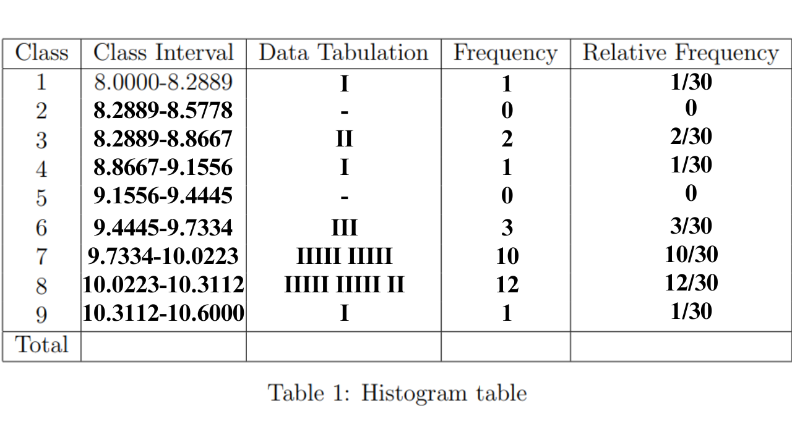
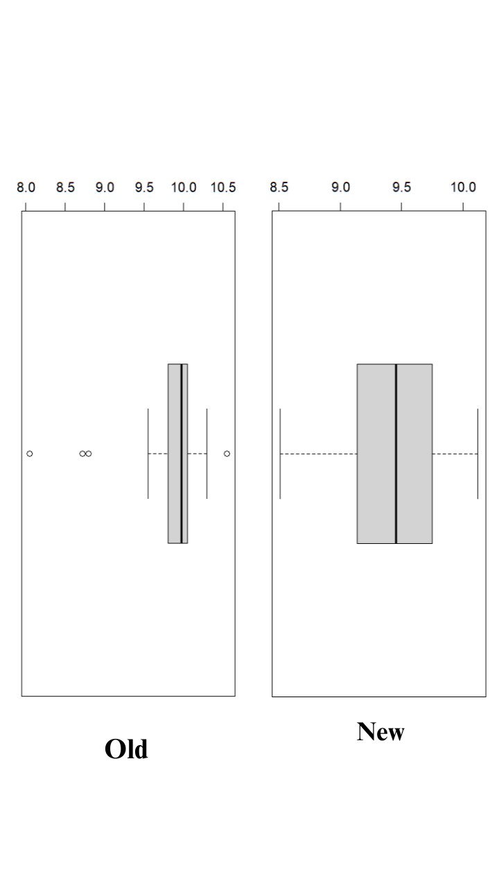

```{r setup, include=FALSE}
knitr::opts_chunk$set(echo = TRUE)
```
# 15/15


## Question 1

20% of my grade will be based on how I do on assignments like this one; there are three other ones. 

10% of my grade will be based on how well I do on labs. 

10% of my grade will be based on how well I do on in class quizzes.

10% of my grade will be based on how well I do on canvas quizzes.

10% of my grade will be based on how well I do on the project.

10% of my grade will be based on how well I do on the Mid-Term Exam.

30% of my grade will be based on how well I do on the Final Exam.

Grade allotment is without any curving and is as follows: 100-90% gets an A, 89-80% gets a B, 79-60% gets a C, 59-50% gets a D, and anything beneath that is an F.

## Question 2

### (a)
```{r}
ddt = read.csv("DDT.csv")
m=with(ddt, as.numeric(factor(MILE)))
coplot(LENGTH~WEIGHT|RIVER*SPECIES,data=ddt, col=m)
```

### (b)

The length and weight of Catfish in the FCM, LCM, and SCM rivers.

### (c)

Line A creates a variable that contains factored MILE as a numeric vector. MILE was factored (made qualitative) and then converted into a numeric vector, and this result was placed under variable 'm'.

### (d)

Line B finds the length of the unique (non-duplicate) values of 'm'.

### (e)

The top six plots are empty because the data does not account for LMBASS and SMBUFFALO being in FCM, LCM, or SCM.

### (f)

```{r}
catfishInFCM <- subset(ddt, RIVER=="FCM" & SPECIES =="CCATFISH",)
ddtLevels1 <- c(catfishInFCM$DDT)
mean(ddtLevels1)
```

## Question 3

### (a)
quantitative

### (b)
quantitative

### (c)
qualitative

### (d)
quantitative

### (e)
qualitative

### (f)
quantitative

### (g)
qualitative

## Question 4

### (a)

The names of the four random sampling designs are: simple random sampling, stratified random sampling, cluster random sampling, and systematic random sampling.

### (b)

In simple random sampling, individuals of a population are equally likely to be sampled and, in fact, are sampled accordingly.

In stratified random sampling, a population is partitioned into sub-populations (which are known as strata) by determined qualities key to each sub-population from which individuals are randomly selected to be part of a sample.

In cluster random sampling, a population is broken into randomly selected clusters that are supposed to be representative of the population from which they are gathered and then a sample is drawn from these clusters.

In systematic random sampling, every nth (4, 5, 6, etc.) individual is chosen from the population to be part of a sample.

## Question 5

```{r}
mtbe=read.csv("MTBE.csv")
sample1=sample(1:223, 5, replace = FALSE)
mtbe[sample1, ]
```

### (a)

#### (i)

```{r}
mtbeo=na.omit(mtbe)
print(mtbeo)
```

#### (ii)

```{r}
depth=mtbeo[mtbeo$Aquifier=="Bedrock",]$Depth
sd(depth)
```

## Question 6

```{r}
eq=read.csv("EARTHQUAKE.csv")
sample2=sample(1:2929, 30, replace = FALSE)
eq[sample2, ]
```

### (a)

#### (i)

```{r}
plot(ts(eq$MAGNITUDE))
```

#### (ii)

```{r}
median(eq$MAGNITUDE)
```

## Question 7

### (a)

The data was collected via method of stratified random sampling.

### (b)

The population is all the fish of the Tennessee River.

### (c)

The qualitative variables are the following: river location and species.

## Question 8

### (a)

A bar graph is used to describe the data.

### (b)

Types of Robotic Limbs (qualitative)

### (c)

The social robot with legs only is used the most.

### (d)

```{r}
freq1=c(15, 8, 63, 20)
RL=c("None", "Both", "LegsO", "WheelsO" )
l=rep(RL, freq1)
```

Class relative frequencies are as follows: 15/106 for None, 8/106 for Both, 63/106 for Legs Only, and 20/106 for Wheels Only.

### (e)

```{r}
pareto<-function(x,mn="Pareto barplot",...){  # x is a vector
  x.tab=table(x)
  xx.tab=sort(x.tab, decreasing=TRUE,index.return=FALSE)
  cumsum(as.vector(xx.tab))->cs
  length(x.tab)->lenx
  bp<-barplot(xx.tab,ylim=c(0,max(cs)),las=2)
  lb<-seq(0,cs[lenx],l=11)
  axis(side=4,at=lb,labels=paste(seq(0,100,length=11),"%",sep=""),las=1,line=-1,col="Blue",col.axis="Red")
  for(i in 1:(lenx-1)){
  segments(bp[i],cs[i],bp[i+1],cs[i+1],col=i,lwd=2)
}
title(main=mn,...)

}

pareto(l)
```

## Question 9

### (a)

```{r}
tab <- matrix(c(32, 6, 12), ncol=3, byrow = TRUE)
colnames(tab) <- c("Windows", "Explorer", "Office")
tab <- as.table(tab)

labels1 <- paste(colnames(tab), "\n", tab, sep =" ")

pie(tab, labels = labels1, main="Pie Chart of Microsoft Products with Security Issues")
```

### (b)

```{r}
freq2 = c(6, 8, 22, 3, 11)
repercussions = c("Denial of Service", "Information disclosure", "Remote Code Execution", "Spoofing", "Privilege Elevation")
l1 = rep(repercussions, freq2)
pareto(l1)
```

## Question 10

```{r}
swd=read.csv("SWDEFECTS.csv")
library(plotrix)
tab1=table(swd$defect)
rtab1=tab1/sum(tab1)
round(rtab1, 2)
pie3D(rtab1,labels=list("OK","Defective"),main="pie plot of SWD")
```

## Question 11

### (a)
```{r}

relativeFrequencies1 <- c(.0333, 0, .0666, .0333, 0, .1, .3333,.4, .0333)
names(relativeFrequencies1)=c("1", "2", "3", "4", "5", "6", "7", "8", "9")
barplot(relativeFrequencies1,space=0)
```

### (b)

```{r}
volts=c(9.98, 10.26, 10.05, 10.29, 10.03, 8.05, 10.55, 10.26, 9.97, 9.87, 10.12, 10.05, 9.80, 10.15, 10.00, 9.87, 9.55, 9.95, 9.70, 8.72, 9.84, 10.15, 10.02, 9.80, 9.73, 10.01, 9.98, 8.72, 8.80, 9.84)

stem(volts)
```

The graph from part a is more informative about where most of the voltage readings lie.

### (c)

```{r}
voltages=read.csv("VOLTAGE.csv")
newVoltages=with(voltages, voltages[LOCATION=="NEW",])
newVolts=newVoltages$VOLTAGE
maximumNewVolt=max(newVolts)
minimumNewVolt=min(newVolts)
lept=minimumNewVolt-.05
rept=maximumNewVolt+.05
range=rept-lept
inc=range/9
cl=seq(lept, rept, by=inc)
cvtn=cut(newVolts,breaks=cl)
new.tab=table(cvtn)
barplot(new.tab,space=0,main="Frequency Histogram (NEW)", las=2)
```

### (d)

No, the new process is not as good nor better than the old.

### (e)

```{r}
getMode=function(v){
  uniqv=unique(v)
  uniqv[which.max(tabulate(match(v, uniqv)))]
  }

meanNew=mean(newVolts)
medianNew=median(newVolts)
modeNew=getMode(newVolts)

oldVolts=volts

meanOld=mean(oldVolts)
medianOld=median(oldVolts)
modeOld=getMode(oldVolts)

print(meanNew)
print(medianNew)
print(modeNew)
print("-------")
print(meanOld)
print(medianOld)
print(modeOld)
```
Due to the "skewdness" of the data, median is the preferred measure of central tendency here.

### (f)

```{r}
zOld=(10.50 - meanOld)/(sd(oldVolts))
zOld
```

### (g)

```{r}
zNew=(10.50-meanNew)/(sd(newVolts))
zNew
```

### (h)

A voltage reading of 10.50 is more likely at the old location as the z-score is lower. This means that 10.50 is closer to the average for the old location than the new location.

### (i)

```{r}
boxplot(oldVolts)
```

Yes, an outlier is detected by boxplot at the old location.

### (j)

```{r}
oldZScores=(oldVolts - meanOld)/sd(oldVolts)
#any absolute z-score greater than 3 is an outlier.

oldVoltsAndScores=table(oldVolts, oldZScores)

#oldVoltsAndScores
```
By the method of z-scores to detect outliers, 8.05 is an outlier as it possess an absolute z-score greater than 3.

### (k)

```{r}
boxplot(newVolts)
```
No, not a single outlier is detected using a box plot for the new location.

### (l)

```{r}
newZScores=(newVolts - meanNew)/sd(newVolts)
#any absolute z-score greater than 3 is an outlier.

newVoltsAndScores=table(newVolts, newZScores)

#newVoltsAndScores
```

No outliers are detected at the new location by the method of z-scores for outlier detection.

### (m)

```{r}

```

Based on these boxplots, it looks like while the new location may not have as much a likelihood for good processes, it is less sporadic in its voltage than the old location.

## Question 12

```{r}
pipeSurfaces=read.csv("ROUGHPIPE.csv")

pipeSurfaceRoughness=pipeSurfaces$ROUGH

pipeSurfaceZScores=(pipeSurfaceRoughness - mean(pipeSurfaceRoughness))/(sd(pipeSurfaceRoughness))

l1=list(pipeSurfaceRoughness)
#l1
l2=list(pipeSurfaceZScores)
#l2
```

95% of the distribution lies between z=-1.96 and z=1.96. This means 1.06 (z=-1.567) to 2.64 (z=1.4487) would be the most likely interval to contain about 95% of all coated pipe roughness measurements.

## Question 13

### (a)
```{r}
mongorians=read.csv("GOBIANTS.csv")
mean(mongorians$AntSpecies)
median(mongorians$AntSpecies)
getMode(mongorians$AntSpecies)
```
From the mean, there are around 13 different species of ants at each of the 11 sites.

From the median, the hypothetical numerical extremes of species count for each site is centered around 5.

From the mode, there are most usually 5 different species in each of the 11 sites.

### (b)

The mean is greater than the median by a fair bit. This implies the data is positively skewed. This means that median is the best measure of central tendency here.

### (c)

```{r}
dryMongorians=with(mongorians, mongorians[Region=="Dry Steppe",])
mean(dryMongorians$PlantCov)
median(dryMongorians$PlantCov)
getMode(dryMongorians$PlantCov)
```

### (d)

```{r}
gobiMongorians=with(mongorians, mongorians[Region=="Gobi Desert",])
mean(gobiMongorians$PlantCov)
median(gobiMongorians$PlantCov)
getMode(gobiMongorians$PlantCov)
```
### (e)

Yes, the center of the total plant cover percentage distribution appears to be different at the two regions.

## Question 14

### (a)

```{r}
samsung=read.csv("GALAXY2.csv")
samsungSpeed=samsung$VELOCITY
maximumSamsungSpeed=max(samsungSpeed)
minimumSamsungSpeed=min(samsungSpeed)
lept1=minimumSamsungSpeed-.05
rept1=maximumSamsungSpeed+.05
range1=rept1-lept1
inc1=range1/9
cl1=seq(lept1, rept1, by=inc1)
cvtn1=cut(samsungSpeed,breaks=cl1)
new.tab=table(cvtn1)
#barplot(new.tab,space=0,main="Frequency Histogram (Velocities)", las=3)
hist(samsungSpeed, nclass=10)
```

### (b)

Yes, the fact that there seems to be two central tendencies in the data lends credence to the double cluster theory.

### (c)

```{r}
samsungSpeedA=with(samsung, samsung[VELOCITY < 21000,])
mean(samsungSpeedA)
median(samsungSpeedA)
getMode(samsungSpeedA)
sd(samsungSpeedA)

print("--------")

samsungSpeedB=with(samsung, samsung[VELOCITY > 21000,])
mean(samsungSpeedB)
median(samsungSpeedB)
getMode(samsungSpeedB)
sd(samsungSpeedB)
```

### (d)

The galaxy is more likely to belong to cluster A1775A as it's average velocity is closer to that value than the average velocity of A1775B.

## Question 15

```{r}
library(ggplot2)
gg1 <- ggplot(data=ddt, mapping=aes(x=RIVER, y =LENGTH, fill = SPECIES)) + geom_boxplot() + stat_summary(fun = "mean", geom = "point", shape = 8, size = 2, color = "white") + ggtitle("HARLEY COMBEST")
gg1
```

