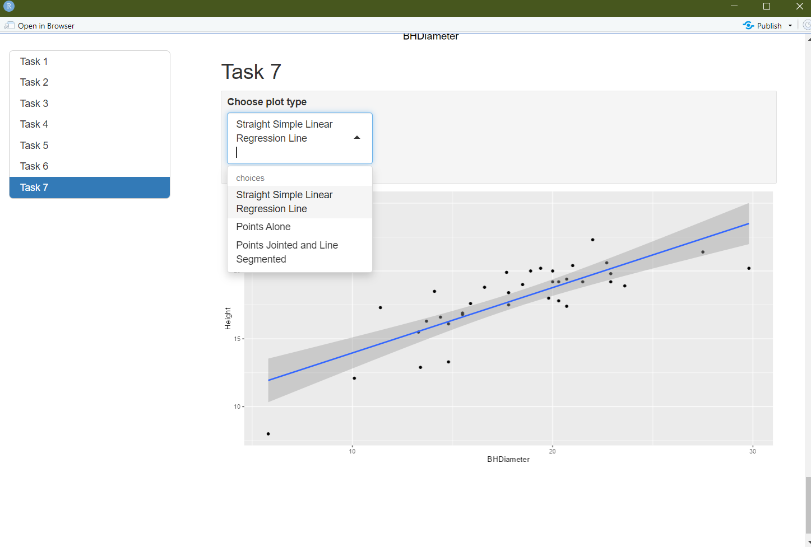

```{r setup, include=FALSE}
knitr::opts_chunk$set(echo = TRUE)
```

## Task 1

```{r}
getwd()
```
## Task 2

```{r}
spruce.df<-read.csv("SPRUCE.csv")
head(spruce.df)
```

## Task 3

```{r}

layout(matrix(1:6,nr=3,nc=2,byrow=TRUE))

plot(Height~BHDiameter, main = "Tree Height vs BHDiameter",
     xlab = "Breast Height Diameter (cm)", ylab = "Height of Tree (m)",
     pch = 21, bg = "blue", cex = 1.2,
     xlim = c(0, max(BHDiameter) * 1.1), ylim = c(0, max(Height) * 1.1),
     data = spruce.df)

library(s20x)
trendscatter(Height~BHDiameter,f=0.5, data=spruce.df)
trendscatter(Height~BHDiameter,f=0.6, data=spruce.df)
trendscatter(Height~BHDiameter,f=0.7, data=spruce.df)

spruce.lm=with(spruce.df, lm(Height~BHDiameter))
trendscatter(Height~BHDiameter,f=0.7, data=spruce.df)
abline(spruce.lm)#The graph is not straight line appropriate
```

## Task 4

```{r}
lo=layout(matrix(1:4,nr=2,nc=2,byrow=TRUE))
layout.show(4)

mycex=1.0
# Scatter plot and fitted line
with(spruce.df, 
     plot(Height~BHDiameter, main = "Tree Height vs BHDiameter",
          xlab = "Breast Height Diameter (cm)", ylab = "Height of Tree (m)",
          bg = "Blue", pch=21, cex = mycex, 
          ylim = c(0, 1.1 * max(Height)), xlim = c(0, 1.1 * max(BHDiameter)))
)
abline(spruce.lm)

# Residual line segments
# make yhat the estimates of E[Height | BHDiameter]
yhat = with(spruce.df, predict(spruce.lm, data.frame(BHDiameter)))
# OR you could use -- (yhat values the predicted values for all the BHDiameter values )
yhat = fitted(spruce.lm)

with(spruce.df, 
     plot(Height~BHDiameter, main = "RSS",
          xlab = "Breast Height Diameter (cm)", ylab = "Height of Tree (m)",
          bg = "Blue", pch=21, cex = mycex, 
          ylim = c(0, 1.1 * max(Height)), xlim = c(0, 1.1 * max(BHDiameter)))
)

# Draw in segments making the residuals (regression deviations)
with(spruce.df, {
  segments(BHDiameter, Height, BHDiameter, yhat)
})
abline(spruce.lm)

# Mean and model line segments
with(spruce.df, 
     plot(Height~BHDiameter, main = "MSS",
          xlab = "Breast Height Diameter (cm)", ylab = "Height of Tree (m)",
          bg = "Blue", pch=21, cex = mycex, 
          ylim = c(0, 1.1 * max(Height)), xlim = c(0, 1.1 * max(BHDiameter)))
)
with(spruce.df, abline(h = mean(Height)))

with(spruce.df, segments(BHDiameter, mean(Height), BHDiameter, yhat, col = "Red"))
abline(spruce.lm)

# Mean and total deviation line segments
with(spruce.df, 
     plot(Height~BHDiameter, main = "TSS - Plot by Possible Student",
          xlab = "Breast Height Diameter (cm)", ylab = "Height of Tree (m)",
          bg = "Blue", pch=21, cex = mycex, 
          ylim = c(0, 1.1 * max(Height)), xlim = c(0, 1.1 * max(BHDiameter)))
)
with(spruce.df, abline(h = mean(Height)))
with(spruce.df, segments(BHDiameter, Height, BHDiameter, mean(Height), col = "Green"))

RSS=with(spruce.df,sum((Height-yhat)^2))
RSS

MSS=with(spruce.df,sum((yhat-mean(Height))^2))
MSS

TSS=with(spruce.df,sum((Height-mean(Height))^2))
TSS

MSS/TSS 
```

MSS/TSS - This is equivalent to the coefficient of determination (R^2); it tells us how well our statistical model predicts an outcome. Given that this value is between 0 and 1, we can say that this model partially predicts the outcome (of BHD). It's closer to 1 than 0 though; not too shabby.

```{r}
MSS+RSS
```

Yes, TSS=MSS+RSS

## Task 5

```{r}
summary(spruce.lm)
```

The slope is estimated to be  .48147.

The intercept is estimated to be 9.14684.

The equation of the fitted line is Height=9.14683+0.48147BHDiameter.

```{r}
predict(spruce.lm, data.frame(BHDiameter=c(15,18,20)))
```

## Task 6

```{r}
library(ggplot2)
g=ggplot(spruce.df, aes(x=BHDiameter,y=Height,colour=BHDiameter))
g=g+geom_point() + geom_line()+ geom_smooth(method="lm")
g+ggtitle("Height VS BHDiameter")
```

## Task 7

{ width=70% }
 
 


