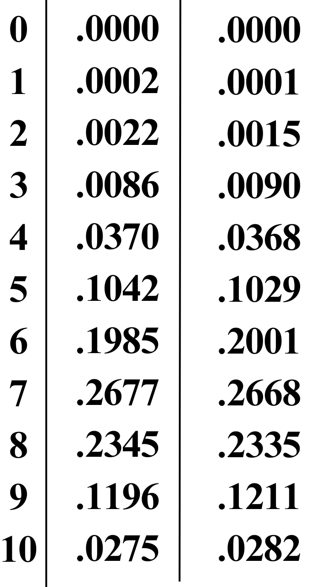
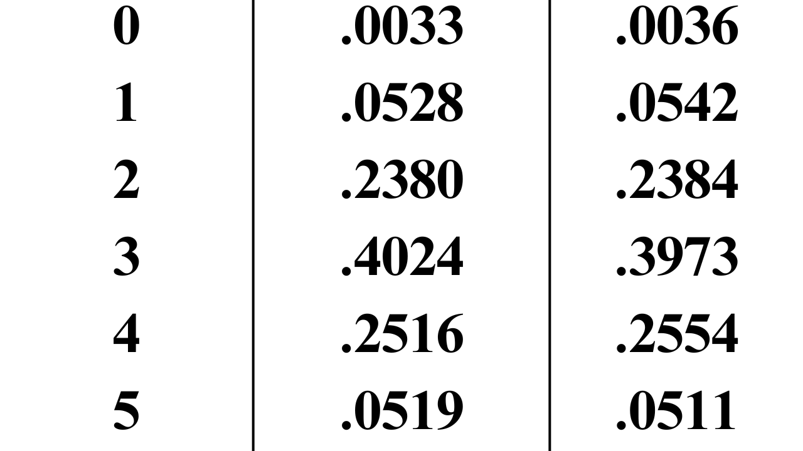

```{r setup, include=FALSE}
knitr::opts_chunk$set(echo = TRUE)
```

# Tasks

## Task 1

```{r}
getwd()
```

## Task 2

```{r, out.width="400px", out.height="400px"}
mybin=function(iter=100,n=10, p=0.5){ 
  # make a matrix to hold the samples
  #initially filled with NA's
  sam.mat=matrix(NA,nr=n,nc=iter, byrow=TRUE)
  #Make a vector to hold the number of successes in each trial
  succ=c()
  for( i in 1:iter){
    #Fill each column with a new sample
    sam.mat[,i]=sample(c(1,0),n,replace=TRUE, prob=c(p,1-p))
    #Calculate a statistic from the sample (this case it is the sum)
    succ[i]=sum(sam.mat[,i])
  }
  #Make a table of successes
  succ.tab=table(factor(succ,levels=0:n))
  #Make a barplot of the proportions
  barplot(succ.tab/(iter), col=rainbow(n+1), main="Binomial simulation", xlab="Number of successes")
  succ.tab/iter
}

mybin(iter=100,n=10, p=0.7)
mybin(iter=200,n=10, p=.7)
mybin(iter=500,n=10,p=.7)
mybin(iter=1000,n=10,p=.7)
mybin(iter=10000,n=10,p=.7)

#verifying using dbinom
dbinom(x=0,size=10,prob=.7)
dbinom(x=1,size=10,prob=.7)
dbinom(x=2,size=10,prob=.7)
dbinom(x=3,size=10,prob=.7)
dbinom(x=4,size=10,prob=.7)
dbinom(x=5,size=10,prob=.7)
dbinom(x=6,size=10,prob=.7)
dbinom(x=7,size=10,prob=.7)
dbinom(x=8,size=10,prob=.7)
dbinom(x=9,size=10,prob=.7)
dbinom(x=10,size=10,prob=.7)

#simulation (left) compared to dbinom (right) values

```

## Task 3

```{r,out.height="400px",out.width="400px"}
whiteMarbles=12
blackMarbles=8

signOfWhite="1"
signOfBlack="0"

bagOfMarbles=c(1,1,1,1, 1,1,1,1, 1,1,1,1, 0,0,0,0, 0,0,0,0)

sample(x=bagOfMarbles,size=5,replace=FALSE)
sample(x=bagOfMarbles,size=5,replace=TRUE)

myhyper=function(iter=100,N=20,r=12,n=5){
# make a matrix to hold the samples
#initially filled with NA's
  sam.mat=matrix(NA,nr=n,nc=iter, byrow=TRUE)
#Make a vector to hold the number of successes over the trials
  succ=c()
  for( i in 1:iter){
#Fill each column with a new sample
  sam.mat[,i]=sample(rep(c(1,0),c(r,N-r)),n,replace=FALSE)
#Calculate a statistic from the sample (this case it is the sum)
  succ[i]=sum(sam.mat[,i])
  }
#Make a table of successes
  succ.tab=table(factor(succ,levels=0:n))
#Make a barplot of the proportions
  barplot(succ.tab/(iter), col=rainbow(n+1), main="HYPERGEOMETRIC simulation", xlab="Number of successes")
  succ.tab/iter
}

myhyper(iter=100,n=5, N=20,r=12)
myhyper(iter=200,n=5, N=20,r=12)
myhyper(iter=500,n=5, N=20,r=12)
myhyper(iter=1000,n=5, N=20,r=12)
myhyper(iter=10000,n=5, N=20,r=12)

dhyper(x=0:19, m=12, n=8, k=5)

#myhyper() on left and dhyper() on right

```

## Task 4

```{r}
mysample=function(n, iter=10,time=0.5){
  for( i in 1:iter){
    #make a sample
    s=sample(1:10,n,replace=TRUE)
    # turn the sample into a factor
    sf=factor(s,levels=1:10)
    #make a barplot
    barplot(table(sf)/n,beside=TRUE,col=rainbow(10), 
            main=paste("Example sample()", " iteration ", i, " n= ", n,sep="") ,
            ylim=c(0,0.2)
    )
    
    #release the table
    Sys.sleep(time)
  }
}

#mysample(n=1000, iter=30, time=1)#ran this as per instructions and it took a while
mysample(n=1000, iter=1, time=1)#including this as per instructions

```

I think mysample() will generate a random sample with replacement, turn this sample into a factor, and make a bar plot out of the factor.

I see a bar plot which describes a similar phenomena to what we see with the Hyper Geometric display of the marble data. However, the number of successes seem closer to being equally likely in this occurrence.

## Task 5

```{r}
choose(8, 4)

#ppois() calculates prob of a rand var will be = or < than a number
#P(Y>4)=P(Y>=5)=1-P(Y<=3)
1 - ppois(4, 2)

#Negbin P(Y=10)
dnbinom(x=10-3, size=3, prob= .4)

#Bin of P(Y<=8)
pbinom(q=8, size=15, prob = .4)
#####
dbinom(x=6, size= 10, prob=.6)
1 - pbinom(6,size=10, prob=.6)
(pbinom(7,10,.6))-(pbinom(2, 10, .6))
```

## Task 6

```{r}
#created my own package and called myFunction from there; it is essentially a copy of Dr. Stewarts mymult function.
myPackage1::myFunction(iter=3,n=10)
```

